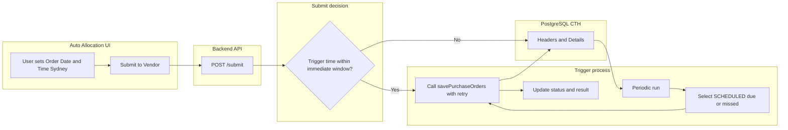

# Order Date & Time and Scheduled Purchase Order Submission

## Current state

- **Order Date & Time** is captured in the UI (Sydney time via `datetime-local`), sent to the backend, and stored as `setOrderDateTme` (UTC) in [CTH.autoAllocationTransHdr](backend/sql/cth_auto_allocation_tables.sql). It is **not** used to delay submission: every "Submit to Vendor" triggers an immediate call to Crunchtime `savePurchaseOrders` and then a single write to the DB with `submittedDateTime` and `transactionNo` set.
- There is no 14-day cap, no "scheduled" path, and no background process. The detail table does **not** store `vendorProductNumber`, which is required to replay a Crunchtime call later.

## Target behavior

- **Order Date & Time** = trigger time for placing the PO with the vendor via `savePurchaseOrders`.
- **Constraint:** Trigger time must be **now or up to 14 days in the future** (Sydney time).
- **Two paths:**
  1. **Immediate:** Trigger time is "now" (e.g. within a short window, e.g. next 2–5 minutes) → call Crunchtime immediately and write to DB as today (existing flow, with validation tightened).
  2. **Scheduled:** Trigger time is in the future (up to 14 days) → write to DB only (all data needed to call Crunchtime later), status = SCHEDULED; a **trigger process** runs periodically, finds due/missed SCHEDULED rows, calls Crunchtime with retry, then updates rows (transactionNo, submittedDateTime, status = SUBMITTED or FAILED).

## Architecture (high level)

## 1. Documentation updates

- **[Project_Brief.md](Project_Brief.md):**
  - Describe Order Date & Time as the **trigger time** for placing POs (Sydney AEST/AEDT), stored in UTC; state **14-day maximum** and that only this window is allowed.
  - Add a short "Scheduled purchase orders" section: two paths (immediate vs scheduled), role of `setOrderDateTme`, workflow statuses (SCHEDULED, SUBMITTED, FAILED), trigger process, retry (5 attempts, 5 min interval), and that future alerting will use failure/attempt fields.
  - In the PostgreSQL section, document new columns (header: status, submission_attempts, last_attempt_at, failure_reason; detail: vendorProductNumber) and their purpose.

## 2. Schema and migration

- **Header table** [CTH.autoAllocationTransHdr](backend/sql/cth_auto_allocation_tables.sql):
  - **status** – `VARCHAR(20) NOT NULL DEFAULT 'SCHEDULED'`. Values: `SCHEDULED`, `SUBMITTED`, `FAILED`. Ensures only SCHEDULED rows are picked for submission and prevents duplicate submission.
  - **submission_attempts** – `INTEGER NOT NULL DEFAULT 0`. Incremented on each Crunchtime attempt.
  - **last_attempt_at** – `TIMESTAMPTZ NULL`. When the last attempt was made (for retry spacing and observability).
  - **failure_reason** – `TEXT NULL`. Last error message for FAILED rows and for future alerting.
  - **submittedDateTime** – keep; set when status becomes SUBMITTED (and optionally leave NULL for SCHEDULED/FAILED).
  - **transactionNo** – keep; set when Crunchtime returns orderNumber.
  - For **immediate** submissions, insert with status = SUBMITTED, submittedDateTime = now, transactionNo from response (no change in behavior from today, except validation).
- **Detail table** [CTH.autoAllocationTransDtl](backend/sql/cth_auto_allocation_tables.sql):
  - **vendorProductNumber** – `VARCHAR(100) NULL`. Required to build Crunchtime `purchaseOrderDetailRows` when the trigger process runs; persist from request line items in both immediate and scheduled flows.
- Provide a **migration script** (e.g. `backend/sql/migrate_scheduled_po_columns.sql`) that adds the new columns and backfills status for existing rows (e.g. `SUBMITTED` where `submittedDateTime IS NOT NULL`).

## 3. Backend API changes

- **[backend/app/purchase_orders/routes.py](backend/app/purchase_orders/routes.py)** (POST `/submit`):
  - **Validation:** Reject if Order Date & Time is more than **14 days** in the future (Sydney). Reject if in the past. Define "immediate" window (e.g. trigger time <= now + 2 minutes Sydney).
  - **Immediate path:** If trigger time is within the immediate window: call Crunchtime as today; insert into CTH with **status = SUBMITTED**, submittedDateTime, transactionNo; return success. Persist **vendorProductNumber** in detail rows.
  - **Scheduled path:** If trigger time is in the future (but within 14 days): **do not** call Crunchtime; insert into CTH with **status = SCHEDULED**, submittedDateTime = NULL, transactionNo = NULL, and all fields needed for later submission (including setOrderDateTme in UTC). Persist **vendorProductNumber** in detail. Return success with a message that the order is scheduled for the given trigger time.
  - **Persistence:** All writes (immediate and scheduled) must store everything required to replay the Crunchtime call: header (locationCode, vendorCode, setExpectedDeliveryDate, setExpectedDeliveryDOW, etc.) and detail (productNumber, productName, **vendorProductNumber**, vendorUnit, orderQuantity). Use a single insert path that accepts an optional status and optional submittedDateTime/transactionNo.

## 4. Trigger process (scheduler / worker)

- **Mechanism:** Implement a **periodic job** that runs at a fixed interval (e.g. every 1–2 minutes). Options: APScheduler inside the FastAPI app, or a separate script run by cron/task scheduler. Recommendation: start with a simple **scheduled task** (e.g. FastAPI startup + APScheduler, or a standalone Python script invoked by cron every 1–2 minutes).
- **Query:** Select from `CTH.autoAllocationTransHdr` where **status = 'SCHEDULED'** and **setOrderDateTme <= now_utc** (plus optional small buffer, e.g. 1 minute, to avoid clock skew). Order by setOrderDateTme. **Do not** select rows where setOrderDateTme is in the future.
- **Missed runs:** Because the condition is `setOrderDateTme <= now_utc`, any SCHEDULED order whose trigger time has passed will be picked up on the next run (no separate "missed slot" logic required).
- **Per row (per location):** For each selected header, build the Crunchtime payload from header + its detail rows (vendorCode, locationCode, setExpectedDeliveryDate → mm/dd/yyyy, detail rows with vendorProductNumber, vendorUnit, orderQuantity). Call `savePurchaseOrders` **once per location** (existing pattern).
- **Idempotency / no duplicates:** Before calling Crunchtime, re-check status in DB (or use a single UPDATE ... SET status = 'PROCESSING' WHERE ... AND status = 'SCHEDULED' RETURNING ... and only process returned rows). After success: UPDATE status = 'SUBMITTED', submittedDateTime = now_utc, transactionNo = response. After final failure: UPDATE status = 'FAILED', failure_reason = message. This ensures each header is only submitted once and future runs skip SUBMITTED/FAILED.

## 5. Retry logic

- **Policy:** On Crunchtime API failure (network error, 5xx, or non-success response), retry up to **5 attempts** with **5 minutes** between attempts (fixed interval as requested).
- **Implementation:** In the trigger process, for each location’s call: loop up to 5 times; on failure, set last_attempt_at and increment submission_attempts, sleep 5 minutes, then retry. If all 5 fail, set status = FAILED and failure_reason (and last_attempt_at). Do not move to the next header until the current one is either SUBMITTED or FAILED after retries.
- **Best practice:** Use a single responsibility per attempt (one Crunchtime call), log each attempt, and avoid retrying on 4xx client errors (only retry on 5xx/network/timeouts if desired).

## 6. Timezone and UX

- **Storage:** Continue storing **setOrderDateTme in UTC** in the DB (convert from Sydney in the API).
- **UI and copy:**
  - In [AutoAllocation.jsx](frontend/src/pages/AutoAllocation.jsx): Label or helper text must state that the value is **"Trigger time (Sydney – AEST/AEDT)"** and that **"Orders will be sent to the vendor at this time (or shortly after). You can schedule up to 14 days ahead."**
  - Enforce **max** on the datetime input: 14 days from now in Sydney (e.g. `max={getMaxOrderDateTimeSydney()}`).
- **Backend:** Validate that order_date_time is not more than 14 days in the future (Sydney); return a clear 400 message if it is.

## 7. Preparation for future alerting

- **Columns already planned:** failure_reason, last_attempt_at, submission_attempts, status. These allow a future alert system to:
  - Find rows with status = FAILED (and optionally submission_attempts >= 5).
  - Use last_attempt_at and failure_reason for context.
- **Optional:** Add a **failed_at** or **alert_sent_at** (TIMESTAMPTZ NULL) column later so the alerting system can mark when an alert was sent and avoid duplicate alerts. Not required in this phase but can be noted in Project_Brief as a future extension.
- **Logging:** In the trigger process, log clearly each submission attempt, success, and final failure (with reason) so logs can be used for alerting or dashboards later.

## 8. Implementation order (suggested)

1. **Schema:** Add new columns (header: status, submission_attempts, last_attempt_at, failure_reason; detail: vendorProductNumber). Migration script + update [cth_auto_allocation_tables.sql](backend/sql/cth_auto_allocation_tables.sql) for new installs.
2. **Backend submit:** Enforce 14-day max and immediate-window rule; split immediate vs scheduled; persist vendorProductNumber and status (SUBMITTED for immediate, SCHEDULED for future); ensure single insert path has all replay data.
3. **Trigger process:** Implement periodic job, query SCHEDULED and setOrderDateTme <= now_utc, build payload from DB, call Crunchtime with 5x5 retry, update status/transactionNo/failure_reason; use status/lock to prevent duplicate submission.
4. **Frontend:** 14-day max on datetime input, clear label "Trigger time (Sydney – AEST/AEDT)" and short explanation.
5. **Documentation:** Update [Project_Brief.md](Project_Brief.md) with the above behavior, schema, and retry/alerting prep.

## 9. Files to touch (summary)

| Area | Files |
|------|--------|
| Schema / migration | [backend/sql/cth_auto_allocation_tables.sql](backend/sql/cth_auto_allocation_tables.sql), new `backend/sql/migrate_scheduled_po_columns.sql` |
| Backend submit + validation | [backend/app/purchase_orders/routes.py](backend/app/purchase_orders/routes.py) (submit flow, 14-day check, immediate vs scheduled, persist status and vendorProductNumber) |
| Trigger worker | New module e.g. `backend/app/purchase_orders/scheduler.py` or `backend/scripts/process_scheduled_orders.py` + wiring (e.g. APScheduler in main or cron) |
| Frontend | [frontend/src/pages/AutoAllocation.jsx](frontend/src/pages/AutoAllocation.jsx) (max 14 days, label and copy) |
| Docs | [Project_Brief.md](Project_Brief.md) (Order Date & Time, 14-day rule, scheduled flow, new columns, retry, alerting prep) |

## 10. Edge cases

- **Clock skew:** Selecting rows with setOrderDateTme <= now_utc + 1 minute can avoid missing orders if the server clock is slightly behind. Optional.
- **Concurrent workers:** If multiple instances run the trigger process, use a row-level lock or UPDATE ... WHERE status = 'SCHEDULED' SET status = 'PROCESSING' RETURNING ... so only one worker processes a given header.
- **Existing rows:** Migration sets status = 'SUBMITTED' where submittedDateTime IS NOT NULL so they are never picked for submission.
